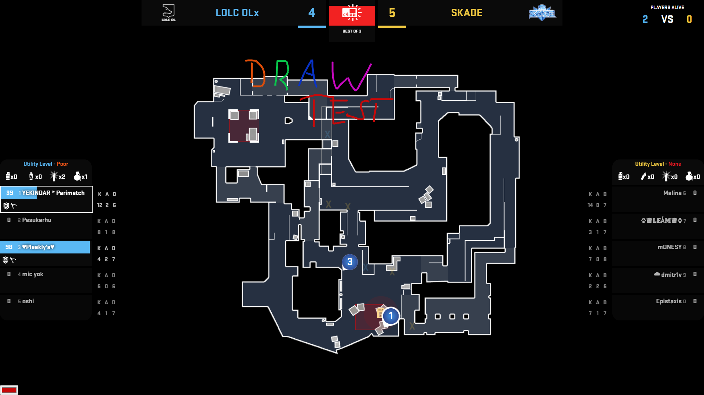

	
Lexogrine Obserview

	

	
Powered by <a href='https://github.com/lexogrine/hud-manager'><strong>« Lexogrine HUD Manager »</strong></a>

# Lexogrine Obserview

Lexogrine HUD Manager 1.11+ required for drawing ability

Standalone Radar HUD for Lexogrine HUD Manager with drawing tool included

- Drawing & synchronizing canvas between PCs
- Option to show avatars on player dots

## Keybinds:
### **Left Alt + A**
>Toggles avatars

## Preview

# Download

To download it just click here: [DOWNLOAD OBSERVIEW](https://github.com/lexogrine/obserview/releases/latest)

